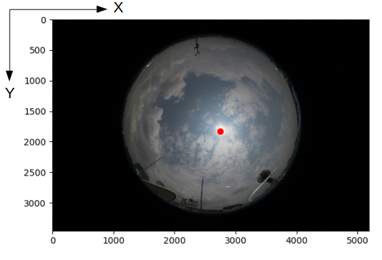

## Sun position computation in a sample sky/cloud image

This repository is a minimalist working version of computing the position of sun in an image. This is inspired from the research performed in the following publications:

> F. M. Savoy, S. Dev, Y. H. Lee, S. Winkler, Geo-referencing and stereo calibration of ground-based whole sky imagers using the sun trajectory, *Proc. IEEE International Geoscience and Remote Sensing Symposium (IGARSS)*, July 2016.

> S. Dev, F. M. Savoy, Y. H. Lee, S. Winkler, Estimation of solar irradiance using ground-based whole sky imagers, *Proc. IEEE International Geoscience and Remote Sensing Symposium (IGARSS)*, July 2016.

### Usage

+ Please store the sample input image inside the `image` folder. 
+ Run the script `python2 find_sun.py`. This computes the position of the sun in the image. Please note the definition of the reference axis in the image. 